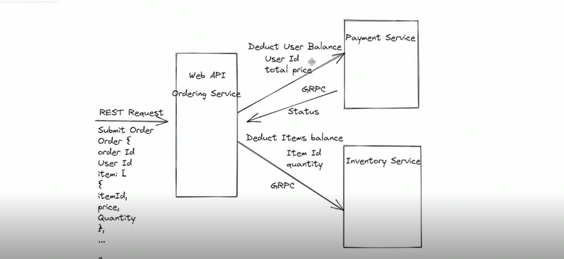

# ITI-GrpcTask
Task for implement Grpc make some services communicate with each other then with Client (Angular)
## Description  
- We have 2 services that help us in making order which were Payment service for check for User Payment and Inventory Service for check products availability

[1] The First Part of task is to make EndPoint for Posting Order and Communicate with the 2 services via Rest

[2] The Second Part is TO Create angular Client and Use Grpc Client also Convert OrderEndpoint into Order Service then Use it in Client Side 

